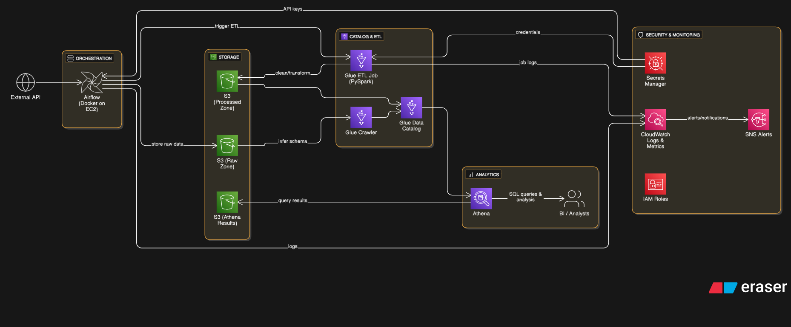

# Automated Weather Pipeline 

This project is a real data engineering workflow I built to automate weather data ingestion, cleaning, and analytics using **Airflow**, **AWS Glue**, **S3**, **Glue Crawler**, and **Athena**.  
The pipeline runs in two stages:  
**(1) fetch & store raw data**,  
**(2) clean & prepare data for analytics**.

---

## 🔥 What This Pipeline Does (In Simple Words)

1. **Airflow DAG #1** calls a weather API → stores raw JSON in S3.  
2. **Airflow DAG #2** waits for that raw file → triggers a Glue ETL job.  
3. **Glue PySpark script** cleans/normalizes the JSON → writes partitioned Parquet to S3.  
4. **Glue Crawler** picks up new files → updates the Data Catalog.  
5. **Athena** queries the final dataset in seconds.

This is the exact workflow used in most production ETL setups.

---

## 📌 Why I Built It

I wanted a project that shows **actual skills** a data engineer uses daily:

- scheduling & dependency management with **Airflow**  
- API ingestion and idempotent S3 writes  
- S3 raw layer → cleaned layer (medallion pattern)  
- distributed Spark transformations using **AWS Glue**  
- automated schema discovery via **Glue Crawler**  
- analytical querying using **Athena**

This pipeline covers the full lifecycle from ingestion → transformation → analytics.

---

## 🏗 Architecture



**High-level flow**  
Airflow (DAG 1) → S3 raw → Airflow (DAG 2) → Glue ETL → S3 cleaned → Glue Crawler → Glue Data Catalog → Athena

---

## 📁 Repo Structure

```

Automated-Weather-Pipeline-using-Airflow/
│
├── dags/
│   ├── dag_api_extract.py        # DAG 1 – API extraction -> raw S3
│   └── dag_trigger_glue.py       # DAG 2 – wait & trigger Glue ETL
│
├── glue_scripts/
│   └── weather_glue_transform.py # PySpark Glue ETL script
│
├── requirements.txt
├── airflow.png                   # Architecture diagram
└── README.md

````

---

## 🛠 Tech Stack & Tools

- Orchestration: **Apache Airflow** (Docker + docker-compose)  
- Cloud: **AWS S3**, **AWS Glue (PySpark)**, **Glue Crawler**, **Glue Data Catalog**, **Amazon Athena**, **CloudWatch**  
- Languages / libs: Python 3.x, Boto3, PySpark, requests/json  
- Local dev: Docker, docker-compose

---

## ⚙️ Setup & Deployment (Step-by-step)

> Replace placeholders like `<your-bucket>`, `<GLUE_JOB_NAME>`, `<glue-role-arn>` with your actual values.

### 1) Local Airflow (Docker)
```bash
# from project root
mkdir -p dags logs plugins
docker-compose up -d
# copy the repo's dags/ into Airflow's DAG folder or mount the repo DAGs in docker-compose
````

### 2) S3 Layout

Create S3 locations (single bucket or two separate buckets):

```
s3://<your-bucket>/raw/weather/YYYY-MM-DD/<timestamp>.json   # raw payloads
s3://<your-bucket>/cleaned/weather/observation_date=YYYY-MM-DD/  # parquet output (partitioned)
s3://<your-bucket>/glue-temp/   # glue temp / bookmark / temp dir
```

### 3) Airflow Connections & Variables

* Airflow UI → Admin → Connections:

  * `aws_default` (AWS credentials / role)
  * `http_default` (if using HttpHook)
* Airflow Variables / Environment:

  ```
  S3_BUCKET=<your-bucket>
  API_KEY=<weather-api-key>
  GLUE_JOB_NAME=<GLUE_JOB_NAME>
  ```

### 4) DAG 1 — API extraction

* **Task** `fetch_weather_data`:

  * Calls external weather API (requests or HttpHook)
  * Writes deterministic file to `s3://<your-bucket>/raw/weather/<date>/<timestamp>.json`
  * Idempotent naming (date + timestamp)
  * Retries enabled (e.g., 3 with exponential backoff)

### 5) Create Glue Job (Console / Terraform)

* Job name: `weather-glue-job` (or `GLUE_JOB_NAME`)
* IAM role: `<glue-role-arn>`
* Glue version: 3.0 or 4.0 depending on libs
* Script path: `s3://<your-bucket>/scripts/weather_glue_transform.py` or upload from repo
* Temporary directory: `s3://<your-bucket>/glue-temp/`

**Glue job config (example):**

* Worker type: Standard / G.1X
* Number of workers: adjust for dataset size (dev: 2–5)

### 6) Glue PySpark script responsibilities

* Read raw objects from `s3://<your-bucket>/raw/weather/`
* Parse JSON, flatten nested structures
* Rename columns to snake_case & friendly names
* Filter invalid or null-critical records
* Convert data types & create `observation_date` column
* Write Parquet output partitioned by `observation_date`:
  `s3://<your-bucket>/cleaned/weather/observation_date=YYYY-MM-DD/`
* Optionally persist job metrics/logs to CloudWatch or S3

### 7) DAG 2 — Trigger Glue ETL

* **Task** `wait_for_previous_day`: verify raw file for previous run exists in S3
* **Task** `start_glue_job`: start Glue job via Boto3 (`glue.start_job_run`)
* **Task** `poll_glue_job_status`: poll / wait for Glue completion
* **Task** `run_crawler` (optional): start Glue Crawler to refresh Data Catalog

### 8) Glue Crawler

* Source: `s3://<your-bucket>/cleaned/weather/`
* IAM role: crawler role with S3 read + Glue write
* Target DB: `weather_db` (or similar)
* Frequency: run after Glue job finishes (triggered by Airflow DAG 2)

### 9) Athena

* Use the `weather_db` created/updated by crawler
* Example query (see below)

---

## ✅ Example Athena Query

```sql
SELECT
  station_id,
  temperature,
  humidity,
  wind_speed,
  observation_time
FROM weather_db.weather_table
WHERE observation_date = current_date
ORDER BY observation_time DESC
LIMIT 50;
```

---

## 🧪 Testing & Validation

* Test DAG tasks locally:

  ```bash
  airflow tasks test dag_api_extract fetch_weather_data 2024-01-01
  airflow tasks test dag_trigger_glue start_glue_job 2024-01-01
  ```
* Validate S3:

  * Confirm raw files appear under `raw/weather/YYYY-MM-DD/`
  * Confirm Parquet files are written under `cleaned/weather/observation_date=.../`
* Validate schema in Athena after crawler runs
* Check CloudWatch logs for Glue job details if ETL fails

---

## ⚠️ Best Practices & Notes

* **Idempotency**: Use deterministic S3 keys (include date/timestamp/execution_id) to avoid accidental reprocessing.
* **Partitioning**: Partition by `observation_date` to reduce Athena scan costs.
* **File sizing**: Use `coalesce()`/`repartition()` to avoid many small files.
* **Security**: Use IAM roles and `iam:PassRole` for Glue; avoid hardcoding AWS keys in code.
* **Monitoring**: Enable CloudWatch log streaming for Glue; use Airflow SLA/alerts for failed DAGs.
* **Cost control**: Optimize Glue workers; consider Glue job bookmarks or incremental processing for large datasets.

---

## Implementation Notes (How I did it)

* Built two Airflow DAGs: one for ingestion (API → raw S3) and one for orchestration of ETL (wait → Glue → Crawler).
* Glue PySpark script performs JSON flattening, type-casting, deduplication, and writes partitioned Parquet.
* Glue Crawler updates Glue Data Catalog to make tables immediately available in Athena.
* Ensured idempotent file naming and retry logic in Airflow for reliability.

---

## Resume / Interview Bullets (copy-paste)

* Designed and implemented an end-to-end ETL pipeline using **Airflow → S3 → AWS Glue → Glue Crawler → Athena**, converting REST API payloads into partitioned Parquet datasets for fast analytics.
* Implemented idempotent ingestion, partition strategy, and robust DAG retries to ensure data reliability and operational stability.
* Automated schema discovery and catalog updates for downstream data consumers, enabling rapid ad-hoc analysis and dashboarding.

---

## Author

**Gnana Prakash N** — Aspiring Data Engineer (1–2 years practical experience)
GitHub: [gnanaprakashn](https://github.com/gnanaprakashn)
Email: `<your email>`

---

## License

MIT © 2025

